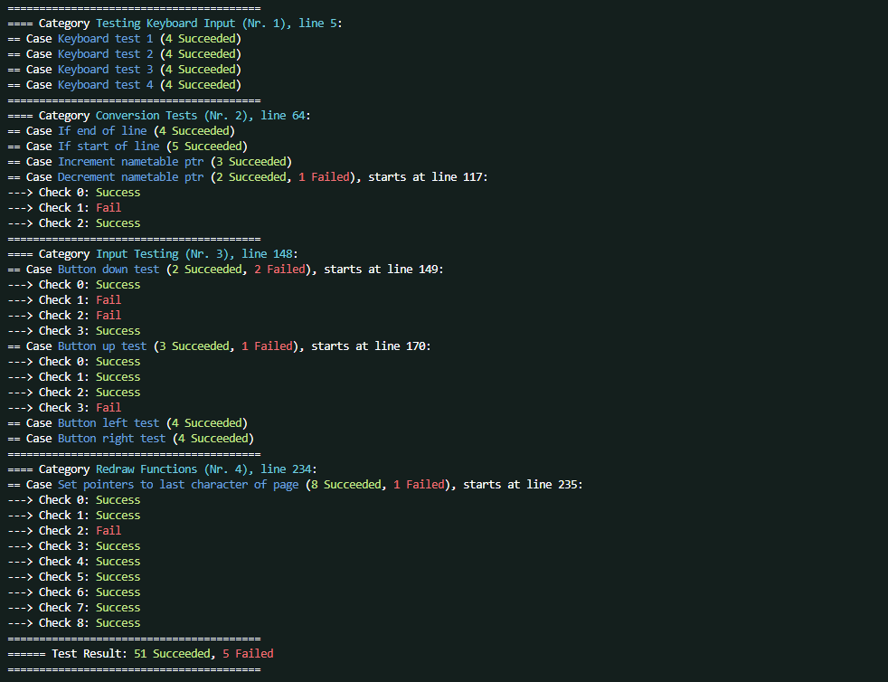
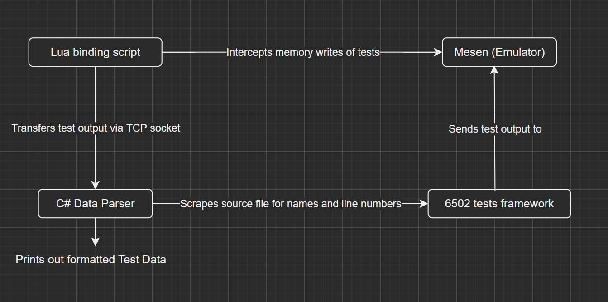

# NESTest
NESTest is a unit testing framework you can use for making games with [cc65](https://cc65.github.io/) and [Mesen](https://mesen.ca/) (i.e. 6502 assembly). It allows you to test and verify that the expected values in your code stay expected, no matter what.

Here's what kind of output you can expect:



## Getting Started
To get started, see the implementation example under `/nes-example`. It implements the framework and its files and provides:
- A test running script (`run_tests.bat`)
- An example `tasks.json` for use within Visual Studio Code (`example_tasks.json`)
- An example pre-commit hook for running before every git commit (`pre-commit-example`)

This project requires a version of the .NET Runtime framework to be installed. Alternatively, find a self-contained version of `NESTestExplorer.exe` under Releases.

`NESTestExplorer.exe` is run by `run_tests.bat` (or your own script) and takes 2 arguments:
```
NESTestExplorer <RunnerCommand> <TestFilePath>
```
**`RunnerCommand`**: The command that runs mesen for you, in this format:
<br>
`path/to/mesen --testrunner path/to/rom path/to/tests_adapter.lua`

`TestFilePath`: The path to your tests source file, i.e. `tests.s`.

## How To Use

Inside your `tests.s` file, you can now start writing tests!
<br>
Start your test file with a category that groups cases:

```lisp
.include "test_framework.s"

start_tests

__CATEGORY__ ; your category name

end_tests
```

inside this category, you can start writing test cases:

```lisp
__CATEGORY__ ; MyFirstCategory
__CASE__ ; Checking if x works
ldx #5
TEST_x_eq_literal 5
```

And this is technically already a complete test file. A category may have multiple cases, and a case may have multiple calls to a `TEST_` function.

The comments after `CATEGORY` and `CASE` are what is displayed in the Test Explorer output. They are scraped from the source file to provide both line numbers and proper names in the output.

Here is a non-exhaustive list of `TEST_` functions (for the rest see `test_framework.s`):

```lisp
TEST_val_eq_literal address, literal ; checks if [address] = #literal
TEST_val_neq_literal address, literal ; checks if [address] != #literal
TEST_val16_eq_literal lo, hi, literal ; checks if [lo] = #lo of literal and [hi] = #hi of literal
TEST_a_eq_literal literal ; check if [a] = #literal
TEST_carry_set ; check if C-flag set
...
```

When a case fails, the output informs you what line that case is on, and which checks specifically succeded or failed.

If you wish to see a more advanced and thorough usage example, see [NESPad](https://github.com/akadeax/nespad), an NES text editor that utilizes this framework extensively.

## How Does it Work?

There are 4 interacting parts in this project:



### 6502 Tests Framework
The main part you interact with when writing tests. the `TEST_` macros write the result of the test to CPU memory address `2047`.

### Lua Binding Script
`tests_adapter.lua` opens up a TCP socket, and then uses Mesen's Lua API to intercept any memory write to address `2047`. When it is written to, it transfers the value to the data parser over the socket.

### C# Data Parser
Find the source code for this [here](https://github.com/Akadeax/nes-test-explorer).
<br>
This parser is a simple TCP listener that first sets up it's own listening, and then runs the command to execute the emulator with `tests_adapter.lua` attached.

 Once the output is received, it checks the formatting of the output, giving descriptive errors if formatting is off in any way. If the test code is correctly formatted, it outputs a string displaying all tests and whether they succeded. If a check did not, the output informs you of what case, and exactly which checks inside that case failed.

## Extensions
Due to the Data Parser functioning entirely independently, it is possible to run this framework for other emulators if you write your own adapter script. As long as it sends the same data as `test_adapter.lua`, it runs flawlessly.

 Currently only Mesen is supported, but a future adapter for [FCEUX](https://fceux.com/web/home.html) may follow.

 # License
 This is public domain, [Unlicense](https://unlicense.org/) specifically. Whether you wish to use it, contribute, fork, or redestribute; feel free to do so.
